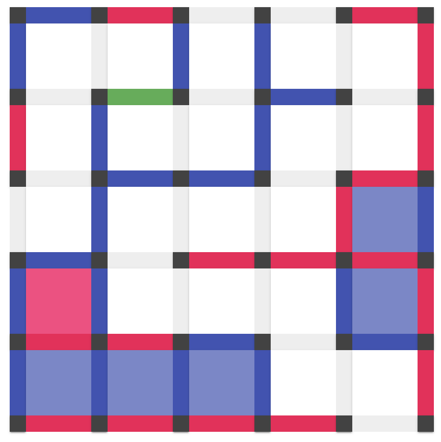

# Dots and Boxes JS

Refer [Wikipedia](https://en.wikipedia.org/wiki/Dots_and_Boxes) for more details about the game.

This is a JS client.

Server is implemented in [dots_and_boxes](https://github.com/tdrmk/dots_and_boxes) repo.

#### Cookies

To prevent game abandonment resulting from user refreshing the browser, cookies are used to persist session information across browser sessions.
Note: it might have unintended consequences on opening in multiple tabs.
Cookies are used to store username, password, user_id and game_id.
Note: Session ID is not store as user can re-access game from another session.

When just username and password are store in cookies, signup/login page is prefilled with details.

If user_id is also available, in that case, user login is automatically triggered. In case of success user directly lands in `/game` route, else a toast is shown indicating error message and user_id is created.

If game_id is also available and login is successful, game is fetched from server, thus facilitating user to continue playing the game.
